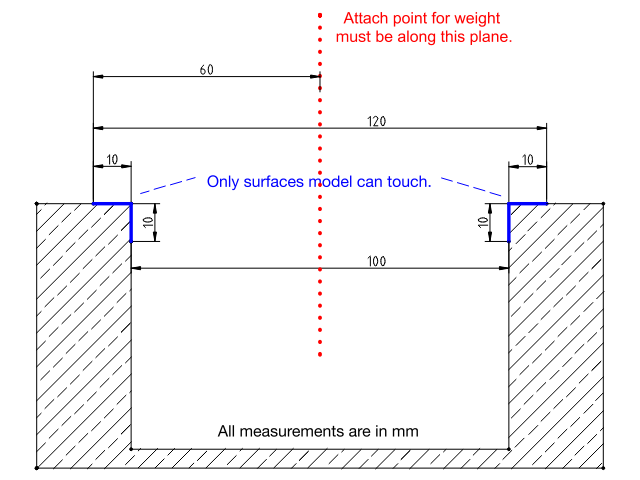

Additive Bearing
================

A competition to use 3D printing to build a weight bearing spanning structure.

### Guidelines

* The 3D printed structure must be printed in one job
* The material will be PLA
* "Mouse ears" do not count towards the maximum size or weight of the object, but must be removed after printing
* Support material may be used and removed after the model has been printed. However, it will count towards the total weight. Use supports wisely.
* The gap to span will be 100mm
* The maximum width (span) of the final structure will be 120mm
* The maximum height of the final structure will be 100mm
* The maximum depth of the final structure will be 100mm
* The load will be applied in the center of the span (50mm from edge of testing rig) from a single point of attatchment
* The structure may only touch a 10mm section, vertical and horizontal, on each side of the gap. The entire depth of the structure may touch.

### Scoring

The score of your bridge will be determined by the ratio between the strength (i.e., maximum
load applied), divided by the weight of your bridge immediately before the competition.

The score will be calculated by the formula of:
```
          (Weight supported in kg)
Score = ----------------------------
         (Weight of model in grams)
```

**Example:** A model weighing 5 grams which was able to hold 10kg, would have a score of 2 (10kg/5g = 2)

The object is to have the highest score possible.

### Testing Rig
The testing rig will be built to the following dimensions:




### Deadline

#### _December 27th, 2014_
